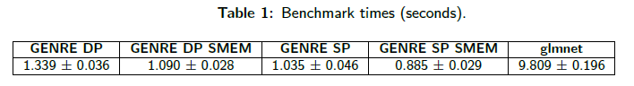
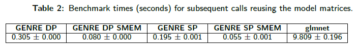

# GENRE (GPU Elastic-Net REgression): A CUDA-Accelerated Package for Massively Parallel Linear Regression with Elastic-Net Regularization

## Table of Contents
1. [Overview](#Overview)
2. [Setup](#Setup)
3. [Model Data Format](#Model-Data-Format)
4. [User-Defined Parameters](#User-Defined-Parameters)
5. [Running the Code](#Running-the-Code)
6. [Tutorial](#Tutorial)
7. [Additional Notes](#Additional-Notes)
8. [Comparing with Other Packages](#Comparing-with-Other-Packages)
9. [License](#License)
11. [Contact Information](#Contact-Information)
12. [Contributing](#Contributing)
10. [Acknowledgements](#Acknowledgements)

## Overview
```GENRE``` (GPU Elastic-Net REgression) is a CUDA-accelerated package that allows for many instances of linear regression with elastic-net regularization to be performed in parallel on a GPU. The specific objective function that is minimized is shown below.


In this equation,  represents the number of observations,  represents the number of predictors,  is the model matrix containing  predictors with  observations each,  is the vector of  observations to which the model matrix is being fit,  is the vector of  model coefficients,  is a scaling factor for the amount of regularization that is applied, and  is a factor in the range [0, 1] that provides a weighting between the L1-regularization and the L2-regularization terms. In order to minimize this objective and obtain the estimated model coefficients contained in , the cyclic coordinate descent optimization algorithm is utilized. This involves minimizing the objective function with respect to one model coefficient at a time. Cycling through all of the model coefficients results in one iteration of cyclic coordinate descent, and iterations are performed until the specified convergence criteria are met. Refer to the ```tolerance_values_h``` and ```max_iterations_values_h``` parameters in the [User-Defined Parameters](#User-Defined-Parameters) section for a description of the two convergence criteria that are used by ```GENRE```. Now, when minimizing the objective function with respect to one model coefficient at a time, the following update is obtained for the model coefficient, where  is a soft-thresholding function. Moreover, 
 represents the estimated value of  leaving the current predictor out. Note that if an intercept term is included, regularization is not applied to this term.


The description provided above describes the process of performing one model fit, but ```GENRE``` allows for many of these fits to be performed in parallel on the GPU by using the CUDA parallel programming framework. GPUs have many computational cores, which allows for a large number of threads to execute operations in parallel. In the case of ```GENRE```, each GPU thread handles one model fit. For example, if 100 individual model fits need to be performed, then 100 computational threads will be required. Performing the fits in parallel on a GPU rather than in a sequential fashion on a CPU can potentially provide a significant speedup in terms of computational time (speedup varies depending on the GPU that is utilized).

## Setup
### Requirements
* A computer with Windows or Linux OS (code was tested on systems using these two operating systems, but it could potentially run on macOS as well)
* CUDA-capable NVIDIA GPU (code was tested using an NVIDIA GeForce GTX 1080 Ti GPU, an NVIDIA GeForce GTX 2080 Ti GPU, and an NVIDIA GeForce GTX 1660 Ti laptop GPU)
  * The speedup that is obtained using ```GENRE``` can vary depending on the GPU that is used.
* MATLAB
  * Note that a MEX-interface is only being used to allow for the C/CUDA code to be called within MATLAB for convenience. With modification, a different interface can be utilized to allow for the C/CUDA code to be called from within another programming language, or the C/CUDA code can be utilized without an interface.
* Parallel Computing Toolbox for MATLAB in order to allow for the compilation of MEX-files containing CUDA code
* C/C++ compiler that is compatible with the release of MATLAB that is being used in order to allow for the compilation of MEX-files containing C/C++ code (compiler compatibility can be found at https://www.mathworks.com/support/requirements/supported-compilers.html) 
  * For Windows, the free community edition of Microsoft Visual Studio 2017 was used as the C/C++ compiler. To download this older version, go to https://visualstudio.microsoft.com/vs/older-downloads/ and create a free Dev Essentials program account with Microsoft. When installing Microsoft Visual Studio 2017, make sure to also check the box for the VC++ 2015 toolset (the 2015 will most likely be followed by a version number). For Linux, the GNU Compiler Collection (GCC) was used as the C/C++ compiler. 
* CUDA toolkit that is compatible with the release of MATLAB (compatibility can be found at https://www.mathworks.com/help/parallel-computing/gpu-support-by-release.html)
  * Once the compatibility is determined, go to https://developer.nvidia.com/cuda-toolkit-archive and install the particular CUDA toolkit version. Note that the installation process for the toolkit will also allow for the option to install a new graphics driver. If you do not desire to install a new driver, then you must ensure that your current driver supports the toolkit version that is being installed. For driver and toolkit compatability, refer to page 4 of https://docs.nvidia.com/pdf/CUDA_Compatibility.pdf.
  
### MATLAB GPU Check
* Before compiling the files that contain the C/CUDA code into MEX-files, you should first check to see that MATLAB recognizes your GPU card. To do so, go to the command prompt and type ```gpuDevice```. If successful, the properties of the GPU will be displayed. If an error is returned, then possible causes will most likely be related to the graphics driver or the toolkit version that is installed.

### Code Compilation for Windows OS
* Assuming the repository is on your system, go to the MATLAB directory that contains the repository folders and add them to your MATLAB path. Following this, go to the ```GENRE_Code``` folder. Type the commands shown below into the MATLAB command prompt.
  * The ```-v``` flag can also be included at the end of each mexcuda command to display compilation details. If the compilation process is successful, then it will display a success message for each compilation in the command prompt. In addition, a compiled MEX-file will appear in each folder. The compilation process is important, and it is recommended to recompile any time a different release of MATLAB is utilized.

```Matlab
cd GENRE_GPU_Single_Precision_Code
mexcuda GENRE_GPU_single_precision.cu
cd ..\GENRE_GPU_Double_Precision_Code
mexcuda GENRE_GPU_double_precision.cu
```

### Code Compilation for Linux OS
* Assuming the repository is on your system, go to the MATLAB directory that contains the repository folders and add them to your MATLAB path. Following this, go to the ```GENRE_Code``` folder. Type the commands shown below into the MATLAB command prompt.
  * These commands are similar to the commands that are used for code compilation for Windows OS, but the path to the CUDA toolkit library must also be included. Note that mexcuda might find the CUDA toolkit library even if you do not explicitly type out its path. In addition, note that there might be differences in your path compared to the one shown above, such as in regards to the version of the CUDA toolkit that is being used. The ```-v``` flag can also be included at the end of each mexcuda command to display compilation details. If the compilation process is successful, then it will display a success message for each compilation in the command prompt. In addition, a compiled MEX-file will appear in each folder. The compilation process is important, and it is recommended to recompile any time a different release of MATLAB is utilized.

```Matlab
cd GENRE_GPU_Single_Precision_Code
mexcuda GENRE_GPU_single_precision.cu -L/usr/local/cuda-10.0/lib64
cd ../GENRE_GPU_Double_Precision_Code
mexcuda GENRE_GPU_double_precision.cu -L/usr/local/cuda-10.0/lib64
```

### Testing GENRE
* To ensure that the setup process is successful, the ```test_GENRE.m``` and the ```test_GENRE_shared_memory.m``` functions are included in the ```GENRE_Code``` folder. In order to execute the ```test_GENRE.m``` function, type the command shown below into the MATLAB command prompt once the previous steps have been completed. 

```Matlab
test_GENRE
```

* This function generates a test dataset consisting of model matrices and data to fit the models to. This dataset is stored into a folder called ```Test_Models```, which is created when the function is executed (the folder is created in the MATLAB directory that is current when the ```test_GENRE.m``` function is called). The function then performs the model fits using ```GENRE```. Both double precision and single precision are tested for the model fits. If the tests are successful, then a folder called ```Test_Model_Coefficients``` will be created (the folder is created in the MATLAB directory that is current when the ```test_GENRE.m``` function is called), and it will contain two ```.mat``` files that are called ```model_coefficients_single_precision.mat``` and ```model_coefficients_double_precision.mat```. These files contain the computed model coefficients for the model fits and the parameters that were used for the model fits (refer to the following sections for more details). In particular, the computed model coefficients are contained in the variable ```B_cell```, where each entry in this cell corresponds to a different model fit. For example, to see the result of the first model fit, the user can load in either one of these files along with the ```model_data_1.mat``` file that is located in the ```Test_Models``` folder. The ```X``` variable that is contained in this file corresponds to the model matrix for the first model fit, and the ```y``` variable corresponds to the data that the model matrix was fit to. The data that is reconstructed by the first model fit can be obtained and plotted along with ```y``` by typing the command shown below in the MATLAB command prompt. It is recommended to do this comparison and see how the model fit turned out in order to further ensure that ```GENRE``` is setup and working properly. Note that once testing is finished, the ```Test_Models``` and ```Test_Model_Coefficients``` folders can be deleted. 

```Matlab
y_first_model_fit = X * B_cell{1};
figure;
plot(y, 'b');
hold on;
plot(y_first_model_fit, 'r');
```

* In order to execute the ```test_GENRE_shared_memory.m``` function, type the command shown below into the MATLAB command prompt.

```Matlab
test_GENRE_shared_memory
```

* This function does the same thing as the ```test_GENRE.m``` function, but it uses smaller model matrix sizes in order to test the case when ```GENRE``` is able to use shared memory in addition to global memory in order to perform the model fits. This function also creates two folders, but they are called ```Test_Shared_Memory_Models``` and ```Test_Shared_Memory_Model_Coefficients```. It is recommended to repeat the same analysis of comparing the reconstructed data by an example model fit to ```y``` for the particular model fit. Note that once testing is finished, the ```Test_Shared_Memory_Models``` and ```Test_Shared_Memory_Model_Coefficients``` folders can be deleted. 

## Model Data Format
As previously stated, ```GENRE``` allows for many models to run in parallel on the GPU. The data for each model fit needs to be saved as a ```.mat``` file. For example, if there are 100 model fits that need to be performed, then there should be 100 ```.mat``` files. Each file should contain the following 3 variables. 
* ```X```: The model matrix 
* ```y```: The vector that contains the observed data to which the model matrix is being fit
* ```intercept_flag```: A flag (either 0 or 1) that indicates whether the model matrix includes an intercept term. Note that if an intercept term is desired, then the first column of ```X``` needs to be a column vector of ones, and ```intercept_flag``` should be set to 1. However, if an intercept term is not desired, then the column vector of ones should not be included in ```X```, and ```intercept_flag``` should be set to 0. 

All of the ```.mat``` files should be saved in a directory. In terms of the naming convention of the files, the code assumes that the file for the first model fit is called ```model_data_1.mat```, the second file is called ```model_data_2.mat```, and so on. However, if desired, this naming convention can be changed by modifying the way the ```filename``` variable is defined in the ```data_organizer.m``` script. Note that ```GENRE``` allows for either single precision or double precision to be utilized for the model fit calculations. However, the input data for each model fit can be saved as either single or double data type. For example, if the variables in the files are saved as double data type, the model fits can still be performed using either single precision or double precision because ```GENRE``` converts the input data to the precision that is selected for the model fit calculations before it is passed to the GPU. The model coefficients that ```GENRE``` returns are converted to the same data type as the original input data. This means that if the data in the model files is saved as double data type and single precision is selected for the GPU calculations, then the returned model coefficients will be converted to double data type.

## User-Defined Parameters
```GENRE``` consists of several files. ```GENRE.m``` is the main function, and its inputs are described in detail below.

* ```precision```: Specifies which numerical precision to use for the model fit calculations on the GPU. The two options are either ```precision = 'single'``` or ```precision = 'double'```. Using double precision instead of single precision on GPUs typically results in a performance penalty due to there being fewer FP64 units than FP32 units and double precision requiring more memory resources as a result of one value of type double being 64 bits versus one value of type single being 32 bits. However, using single precision has the trade-off of reduced numerical precision. Depending on factors such as the conditioning of the model matrices, this reduced precision can lead to significantly different results. Therefore, if you select single precision, then you should ensure that this precision is sufficient for your application. If you are uncertain, then it is recommended to use double precision.

* ```num_fits```: The number of model fits to perform.

* ```data_path```: Path to the directory containing the model data files described in the previous section.

* ```save_path```: Path to the directory where the output file containing the parameters and the computed model coefficients for the model 
fits will be saved to.

* ```output_filename```: The name of the output file containing the parameters and the computed model coefficients for the model fits.

* ```alpha_values_h```: A vector containing  for each model fit.

* ```lambda_values_h```: A vector containing  for each model fit. Note that ```GENRE``` only computes the model coefficients for one value of  for each model fit. This is different from other packages like ```glmnet```, which compute the coefficients for a path of lambda values.

* ```tolerance_values_h```: A vector containing the tolerance convergence criterion value for each model fit (values such as 1E-4 or 1E-5 are reasonable). ```GENRE``` uses the same tolerance convergence criterion as ```glmnet```. Each time a model coefficient is updated, the weighted (all of the observation weights are 1 in this case) sum of squares of the changes in the fitted values due to this update is calculated as , where  is the value of the model coefficient before the update and  is the value of the model coefficient after the update. This will be evaluated for every model coefficient until one iteration of cyclic coordinate descent is completed. The maximum value for this evaluated term is then taken across all of the model coefficients, and it is compared to the specified tolerance value. If the value is less than the tolerance value, then cyclic coordinate descent will stop. However, if it is equal to or greater than the tolerance value, then cyclic coordinate descent will continue.

* ```max_iterations_values_h```: A vector containing the maximum number of iterations convergence criterion for each model fit (100,000 iterations is reasonable because we typically expect the tolerance criterion to be met first).

* ```transformation_flag```: A flag that specifies which transformation option to use for the model fits. Note that all of the model fits need to use the same option for this flag, which is why it is not a vector. In addition, note that all of these transformation options are only applied to the model matrices. When the model fits are performed on the GPU, the data corresponding to ```y``` for each model fit is divided by its standard deviation using the 1/N variance formula regardless of which transformation option is selected, and the input  value for each model fit is also divided by this standard deviation value. However, before they are returned, the coefficients for each model fit are multiplied by these standard deviation values, where there is one standard deviation value for each fit. This means that the coefficients should reflect the scale of the data corresponding to ```y``` before it was divided by its standard deviation. This is similar to the 'gaussian' fit family in ```glmnet```. 
  * ```transformation_flag = 1``` means that each predictor column in the model matrix for each model fit will be standardized on the GPU. The mean of each predictor column is subtracted off from each observation in the column, and each observation in the column is then divided by the standard deviation of the column. Note that the 1/N variance formula is used when calculating the standard deviation similar to the ```glmnet``` software package. Once the model fits are performed, the coefficients will be unstandardized before they are returned due to the fact that the original model matrices were unstandardized. A column vector of ones corresponding to an intercept term must be included in every model matrix in order to select this option. Note that this requirement is only for this option and does not apply to the other options. The intercept term for each fit is not standardized. 
  * ```transformation_flag = 2``` means that each predictor column in the model matrix for each model fit will be normalized on the GPU. Each observation in each predictor column will be divided by a scaling factor. The scaling factor is computed by squaring each observation in the predictor column, summing the squared observations, and taking the square root of the sum. Once the model fits are performed, the coefficients will be unnormalized before they are returned due to the fact that the original model matrices were unnormalized. If an intercept term is included for a particular model fit, it is not normalized. 
  * ```transformation_flag = 3``` means that the model matrices for the model fits are already standardized using the same method described for ```transformation_flag = 1```. Due to the fact that the original model matrices are standardized, the standardized model coefficients will be returned. For a given model fit, if an intercept term is included, make sure that the column vector of ones in the model matrix corresponding to this term is not standardized. 
  * ```transformation_flag = 4``` means that the model matrices for the model fits are already normalized using the same method described for ```transformation_flag = 2```. Due to the fact that the original model matrices are normalized, the normalized model coefficients will be returned. For a given model fit, if an intercept term is included, make sure that the column vector of ones in the model matrix corresponding to this term is not normalized.

## Running the Code
Once the user-defined parameters are specified, the ```GENRE.m``` function can be called within MATLAB. In terms of the processing pipeline, the ```data_organizer.m``` script will be called within this function. This script loops through all of the model data files and organizes the data before it is passed to the GPU. For example, a 1-D array called ```X_matrix_h``` is created that contains the model matrices across all of the model fits in column-major order. As an illustration, if 2 model fits need to be performed and one model matrix is 100 x 1,000 while the other model matrix is 200 x 2,000, then the 1-D array will contain 500,000 elements. The first 100,000 elements will correspond to ```X``` for the first model fit in column-major order, and the remaining 400,000 elements will correspond to ```X``` for the second model fit in column-major order. In addition, a 1-D array called ```y_h``` is also created that contains the sets of observations to which the model matrices are fit. Using the same example just mentioned, the 1-D array will contain 300 elements. The first 100 elements will correspond to ```y``` for the first model fit, and the remaining 200 elements will correspond to ```y``` for the second model fit. Moreover, additional arrays must be created that contain the number of observations for each model fit, the number of predictors for each model fit, and the zero-based indices for where the data for each model fit begins. For example, each model fit is performed by one computational thread on a GPU, so the these arrays are used to ensure that each thread is accessing the elements in the arrays that correspond to the data for its specific model fit.

After the data is organized, the ```GPU_memory_estimator.m``` script will be called in order to estimate the amount of GPU memory that is required to perform the model fits. A check within the script is performed to ensure that the estimate of required memory does not exceed the amount of memory that is available on the GPU. Once this memory check is performed, the ```GENRE.m``` function will then call either the ```GENRE_GPU_single_precision``` MEX-file or the ```GENRE_GPU_double_precision``` MEX-file depending on which option is selected for ```precision```. These two files contain the C/CUDA code that allows for the model fits to be performed in parallel on the GPU. The output of both of these functions is ```B```, which is a 1-D array that contains the computed model coefficients across all of the model fits. The model coefficients for each model fit are then stored into ```B_cell``` so that each entry in the cell contains the model coefficients for one model fit. ```B_cell``` is saved to a ```.mat``` file along with ```precision```, ```alpha_values_h```, ```lambda_values_h```, ```tolerance_values_h```, ```max_iterations_values_h```, and ```transformation_flag```. The name of the file and the directory to which the file is saved are specified as user-defined parameters. In addition, ```B_cell``` is assigned as an output for the ```GENRE.m``` function.


## Tutorial
In this tutorial, we will first write a script to generate model data in order to familiarize ourselves with the model data format that is required for ```GENRE```. We will then use ```GENRE``` to process the data. To begin, create a new script within MATLAB called ```data_creator.m```, and type or copy and paste the following lines of code within the file. Note that the ```save_path``` variable should be defined using your own specified path. In addition, note that a large portion of the code used in this tutorial is similar to the code in the ```test_GENRE.m``` function, but the purpose of this tutorial is to familiarize the user with how to use ```GENRE```.

```Matlab
% Copyright 2020 Christopher Khan

% Licensed under the Apache License, Version 2.0 (the "License");
% you may not use this file except in compliance with the License.
% You may obtain a copy of the license at

%     http://www.apache.org/licenses/LICENSE-2.0

% Unless required by applicable law or agreed to in writing, software
% distributed under the License is distributed on an "AS IS" BASIS,
% WITHOUT WARRANTIES OR CONDITIONS OF ANY KIND, either express or implied.
% See the License for the specific language governing permissions and 
% limitations under the License.


% Description of data_creator.m:
% This script generates toy datasets for illustrating the model data format 
% for GENRE

% Define the number of model fits to generate data for (this can be 
% decreased if you do not have enough RAM or GPU VRAM for this many model 
% fits)
num_fits = 5000;

% Define the path to the directory in which the model data files will be 
% saved
save_path = 'enter path here';

% Generate and save the model data for each model fit
for ii = 1:num_fits
    % Randomly generate the number of observations and predictors for the 
    % model fit 
    num_observations = randi([100, 200], 1);
    num_predictors = randi([400, 500], 1);
    
    % Create the model matrix for the model fit
    X = randn(num_observations, num_predictors);
    
    % Add an intercept term to the model (for this tutorial, we will 
    % include an intercept term to all of the models, but the commented 
    % line below also allows the option to randomly determine whether to 
    % include an intercept term or not)
    intercept_flag = 1;
    
    % Randomly determine whether to add an intercept term or not
    % intercept_flag = randi([0 1], 1);
    
    % Add a column vector of ones to the beginning of the model matrix if 
    % an intercept term is supposed to be included
    if intercept_flag == 1
        X = [ones(num_observations, 1), X];
        num_predictors = num_predictors + 1;
    end
    
    % Randomly generate the model coefficients
    B = randn(num_predictors, 1) .* 100;
    
    % Create the observed data to which the model matrix will be fit
    y = X * B;
    
    % Define the name of the file to which the model data will be saved
    filename = ['model_data_' num2str(ii) '.mat'];
    
    % Save the data for the model fit
    save(fullfile(save_path, filename), '-v7.3', 'X', 'y', 'intercept_flag');

end
```

Once this script is written, run it within MATLAB. This will generate the data for each model fit, and each set of data is saved to an individual file located in the specified directory. The next step is to process the data. Create a new script called ```run_GENRE.m``` and type the lines of code that are shown below.

```Matlab
% Clear the workspace and close all figures
clear all; close all;

% Specify whether to use single precision or double precision (there is
% typically a performance penalty when using double precision instead of
% single precision on GPUs, but using single precision has the trade-off of
% reduced numerical precision). Depending on factors such as the 
% conditioning of the model matrices, this reduced precision can lead to 
% significantly different results. Therefore, if you select single
% precision, then you should ensure that this precision is sufficient
% for your application. If you are uncertain, then it is recommended to use
% double precision.
precision = 'single';

% Specify the number of model fits
num_fits = 5000;

% Specify the path to the files that contain the data for the model fits
data_path = 'enter the same path that you used in the data generator script';

% Specify the path to save out the parameters and the computed model coefficients
% for the model fits
save_path = 'enter the path to the directory that you want the results to be saved to';

% Specify the name of the output file
output_filename = 'model_coefficients.mat';

% Define or load in the alpha values that are used for the model fits (for
% this tutorial, we will randomly generate an alpha value for each of the
% model fits)
alpha_values_h = rand(num_fits, 1); % rand randomly generates numbers between 0 and 1

% Define or load in the lambda values that are used for the model fits (for 
% this tutorial, we will use a lambda value of 0.001 for each of the model
% fits)
lambda_values_h = repmat(0.001, [num_fits, 1]);

% Define the tolerance values that are used for the model fits (for this 
% tutorial, we will use a tolerance value of 1E-4 for each of the model 
% fits)
tolerance_values_h = repmat(1E-4, [num_fits, 1]);

% Define the maximum iterations values that are used for the model fits 
% (for this tutorial, we will use 100,000 as the maximum number of 
% iterations for each of the model fits)
max_iterations_values_h = repmat(100000, [num_fits, 1]);

% Specify the flag that determines which transformation option to use for 
% all of the model fits (1 = standardize the predictors on the GPU and 
% return the unstandardized model coefficients, 2 = normalize the
% predictors on the GPU and return the unnormalized model coefficients,
% 3 = the predictors are already standardized and return the standardized
% model coefficients, and 4 = the predictors are already normalized and
% return the normalized model coefficients). Note that the same 
% transformation flag has to be used for all of the model fits.
transformation_flag = 1;

% Call the GENRE.m function to perform the model fits on the GPU
B_cell = GENRE(precision, num_fits, data_path, save_path, output_filename, ...
    alpha_values_h, lambda_values_h, tolerance_values_h, max_iterations_values_h, ...
    transformation_flag);
```

Once you are finished typing the lines of code above, run the ```run_GENRE.m``` script. This will perform the model fits on the GPU, and it will save out the parameters and the computed model coefficients for the model fits to the specified directory. The variable containing the coefficients that is saved to the file is ```B_cell```, and it should also be available within the MATLAB workspace. Each entry in this cell contains the computed model coefficients for a specific fit. For example, to view the coefficients for the first model fit, type the following command within the MATLAB command prompt.

```Matlab
B_first_model_fit = B_cell{1};
```

Note that since we included an intercept term in every model, the first model coefficient is the value of the intercept term. In addition, also note that ```transformation_flag = 1``` for this tutorial, which means that unstandardized model matrices were transferred to the GPU, where they were then standardized. As a result, the coefficients that were returned represent the unstandardized coefficients. To obtain standardized coefficients, you would need to standardize all of your model matrices before saving them in the model data files. Then, you would need to set ```transformation_flag = 3``` in the ```run_GENRE.m``` script to indicate that the input model matrices are already standardized.

## Additional Notes 
1. As previously stated, ```y``` for each model fit is always standardized on the GPU by dividing it by its standard deviation using the 1/N
   variance formula. Therefore, if the standard deviation of ```y``` is 0 for a particular model fit, then the model fit will not be 
   performed. However, the other model fits will still be performed assuming each of them has a standard deviation of ```y``` that is not 0. 
   When a model fit is not performed, a vector of zeros is returned as the model coefficients corresponding to the model fit.

2. Make sure that for the model matrices, the only predictor column where all of the observations are the same value is the column
   corresponding to the intercept term if it is included. This is due to the fact that standardization or normalization is applied to all of
   the other predictor columns. Therefore, a division by 0 will occur if all of the observations in a predictor column are the same.
   
3. The ```GENRE.m``` function calls either the ```GENRE_GPU_single_precision``` MEX-file or the ```GENRE_GPU_double_precision``` MEX-file  
   depending on what precision is specified. There is some additional overhead the first time either of these MEX-files is called. This is because on the
   first call, all of the input arrays generated by the ```data_organizer.m``` script are transferred to the GPU. For example the model
   matrices are transferred. However, upon subsequent calls to either MEX-file, these arrays do not need to be transferred again because 
   they are already on the GPU. An example of when this might be relevant is if the ```GENRE.m``` function is modified to call either of 
   these MEX-files in a for loop. The only arrays that are transferred every time either MEX-file is called are ```alpha_values_h```, ```lambda_values_h```, ```tolerance_values_h```, ```max_iterations_values_h```, and ```y_h```. The first four arrays contain model fit
   parameters, and the last array is a 1-D array that contains the data contained in `y` for every model fit. This allows for functionality,
   such as calling one of the MEX-files in a for loop that produces the model coefficients for all of the model fits using
   a different parameter set for each iteration. Moreover, this also means that ```y_h``` can be changed each iteration in order to fit the
   model matrices to different sets of data. However, keep in mind that if ```y_h``` is changed in a for loop, then the new ```y_h``` must 
   still be a 1-D array, and the data for each ```y``` in this array must have the same number of observations as before. Adding on, if
   standardization or normalization is applied to the model matrices on the GPU, then this is only done the first time either MEX-file is
   called in order to save computations for subsequent calls. Note that the model matrices cannot be changed if the MEX-files are called
   within a for loop. If it is desired to change the model matrices, then ```clear mex``` must be called in order to unload any
   MEX-functions from memory and to free the memory allocated on the GPU. The ```GENRE.m``` function, as is, does not call the MEX-files in a 
   for loop, so ```clear mex``` is included at the top of the function. Therefore, each time you run the function, it will be called before 
   either of the MEX-files is called. 
   
4. As previously stated, each model fit is supplied a lambda value in ```GENRE```, so the coefficients are not calculated for a path of 
   lambda values. One way of doing this in ```GENRE``` is to make multiple model files containing the same model. Then, a different lambda 
   value can be supplied to each model fit via the ```lambda_values_h``` vector that is an input to the ```GENRE.m``` function. Therefore, the model 
   coefficients for the same model using different lambda values will be computed in parallel on the GPU. In addition, another way of 
   calculating the coefficients for multiple lambda values is to follow the method described in 3 above. For example, the ```GENRE.m``` 
   function can be modified to call either the ```GENRE_GPU_single_precision``` MEX-file or the ```GENRE_GPU_double_precision``` MEX-file in a 
   for loop. In each iteration of the for loop, the ```lambda_values_h``` vector can be modified to have new values and then be supplied to
   the MEX-files. Although this method means that there will be less model fits passed to the GPU at once, one benefit is that it will
   require less memory because multiple copies of the model will not be required.
   
5. When possible, ```GENRE``` uses shared memory on the GPU in addition to global memory when performing the model fits. This memory has lower latency than global memory, so it can 
   potentially improve performance. Whether shared memory is utilized or not is determined in the ```GENRE.m``` function, but it will usually be used if there is at least 32 KB of 
   shared memory available per GPU block and if for the model matrix with the largest number of observations, the number of observations is less than or equal to 250 observations for 
   single precision and less than or equal to 125 observations for double precision. Note that if these two requirements are not met, then shared memory will not be used for the 
   model fits.
   
## Comparing with Other Packages
If you want to compare ```GENRE``` to other packages that perform linear regression with elastic-net regularization, you should check to see what convergence criteria these packages use in order to ensure that convergence for ```GENRE``` and the package being compared to it is being reached at similar points during optimization. For example, ```GENRE``` was developed to produce similar results to ```glmnet```, and both packages use the same tolerance convergence criterion. Therefore, if you are comparing these two packages, make sure to set the ```thresh``` parameter of each model fit in ```glmnet``` to be the same as the corresponding value in the ```tolerance_values_h``` vector of ```GENRE```. The code for the MATLAB port of ```glmnet``` is provided at http://web.stanford.edu/~hastie/glmnet_matlab/index.html. The numerical precision that is being used by the package should also match whatever option is selected for the ```precision``` parameter in ```GENRE```. In addition, when comparing with any package, make sure to use similar predictor transformations in regards to normalization or standardization. Adding on, for timing purposes, note that the ```GENRE.m``` script also includes loading in and organizing the data for all of the model fits because the ```data_organizer.m``` script is called within this script. It also includes saving the parameters and the computed model coefficients for the model fits. Moreover, as discussed in the [Additional Notes](#Additional-Notes) section, there is additional overhead when calling either of the MEX-files for the first time after ```clear mex``` has been called. As a result, these factors should be noted when comparing the time that it takes for ```GENRE``` to run to the time that it takes for another package to run. In terms of speedup, the users who will most likely experience the greatest speedup using ```GENRE``` when compared to other packages are those that need to perform many small fits and analyses such as trying out many different combinations of  and .

### Example Benchmark Comparing GENRE with glmnet
```GENRE``` has the potential to provide significant speedup due to the fact that many model fits can be performed in parallel on a GPU. Therefore, an example benchmark was performed where we compared ```GENRE``` with ```glmnet```, which is written in Fortran and performs the model fits in a serial fashion on a CPU. In this benchmark, 20,000 model matrices were randomly generated within MATLAB. Each model matrix consisted of 50 observations and 200 predictors (50x200), and an intercept term was included for all of the models. Note that to add an intercept term in ```GENRE```, a column of ones was appended at the beginning of each model matrix to make the predictor dimension 201 (adding a column of ones is not required for ```glmnet```). For each model matrix, the model coefficients were randomly generated, and the matrix multiplication of the model matrix and the coefficients was performed to obtain the observation vector. Therefore, this provided 20,000 observation vectors with each containing 50 observations. Once the data was generated, both ```GENRE``` and ```glmnet``` were used to perform the model fits and return the computed model coefficients. An  value of 0.5 and a  value of 0.001 were used for all of the model fits. The tolerance convergence criterion for both packages was set to 1E-4. It was also specified for each package to standardize the model matrices, which means that the unstandardized model coefficients were returned. Note that the column of ones for each model matrix corresponding to the intercept term is not standardized in the case of ```GENRE```. ```GENRE``` allows for the user to select either single precision or double precision for performing the model fits on the GPU, so processing was done for both cases. The MATLAB version of the ```glmnet``` software package includes a compiled executable MEX-file that allows for Fortran code to be called, and it uses double precision for the calculations. In addition, due to the fact that all of the model matrices have a small number of observations (50) in this case, ```GENRE``` is also able to use shared memory in addition to global memory when performing the model fits. Shared memory has lower latency than global memory, so utilizing it can provide performance benefits. Therefore, processing was performed both with and without using shared memory. 

The computer that was used for the benchmarks contained dual Intel Xeon Silver 4114 CPUs @ 2.20 GHz with 10 cores each along with an NVIDIA GeForce GTX 1080 Ti GPU and an NVIDIA GeForce RTX 2080 Ti GPU. The 2080 Ti GPU was used to perform GPU processing. For each case, the average of 10 runs was taken, and timing was performed using MATLAB's built-in timing capabilities. Note that ```GENRE``` has a data organization step that loads the data for the model fits from files and organizes it into the format that is used by the GPU. For this benchmark, this step was not counted in the timing due to the fact that it was assumed that all of the data was already loaded into MATLAB on the host system for both ```GENRE``` and ```glmnet```. The GPU times include the time it takes to transfer data for the model fits from the host system to the GPU, standardize the model matrices, perform the model fits, unstandardize the model coefficients, transfer the computed model coefficients back from the GPU to the host system, and store the coefficients into a MATLAB cell structure. The CPU time includes the time it takes to standardize the model matrices, perform the model fits, unstandardize the model coefficients, and store the coefficients into a MATLAB cell structure. The benchmark results are shown in [Table 1](Table_1_Benchmark_Results.png) below. Note that DP, SP, and SMEM correspond to double precision, single precision, and shared memory, respectively. In addition, note that the input data for the model fits was of type `double` for this benchmark. Therefore, in the case of ```GENRE```, some of the inputs would need to be converted to type single before they are passed to the GPU when using single precision for the computations. Moreover, ```GENRE``` also converts the datatype of the computed model coefficients to the datatype of the original input data. This means that for the single precision cases, the computed model coefficients would need to be converted to be type double after they are passed back to the host system from the GPU. For purposes of benchmarking the single precision cases, the time to perform the type conversions of the inputs to type single was not included, and the returned model coefficients were just kept as type single. This is due to the fact that including these times would increase the benchmark times for the single precision cases in this scenario, and if it were a different scenario, the double precision cases could be impacted instead of the single precision cases. For example, if the type of the original input data was single and double precision was used for the calculations, then these datatype conversions would have to be made for the double precision cases, but they would not have to be made for the single precision cases.

<p align="center">
  
</p>

As shown in [Table 1](Table_1_Benchmark_Results.png), ```GENRE``` provides an order of magnitude speedup when compared to glmnet, and the best performance was achieved by using single precision with shared memory. For ```glmnet```, the benchmark result that is shown was obtained by using the naive algorithm option for the package because this option was faster than the covariance algorithm option. For example, the benchmark result that was obtained when using the covariance algorithm option was 32.271  0.176 seconds. In addition, it is important to note that in these benchmarks, most of the time for ```GENRE``` was spent transferring the model matrices from the host system to the GPU. However, there are cases when once the model matrices have been used in one call, they can be reused in subsequent calls. For example, a user might want to reuse the same model matrices except just change the  value or the  value that is used in elastic-net regularization, or they might want to just change the observation vectors that the model matrices are fit to. By default, each time GENRE is called, the ```clear mex``` command is executed, and the ```GENRE``` MEX-files are setup so that all allocated memory on the GPU is freed when this command is called. However, in a case where the model matrices can be reused after they are transferred once, the ```clear mex``` command can be removed. Essentially, every time one of the MEX-files for GENRE is called for the first time, all of the data for the model fits will be transferred to the GPU. However, if the ```clear mex``` command is removed, then for subsequent calls, all of the data for the model fits will still be transferred except for the model matrices, which will be kept on the GPU from the first call. By not having to transfer the model matrices again, performance can be significantly increased. To demonstrate this, the same benchmark from above was repeated, but for each case this time, ```GENRE``` was called once before performing the 10 runs. This is to replicate the case where the model matrices are reused in subsequent calls. The benchmark results are shown in 
[Table 2](Table_2_Benchmark_Results.png) below. Note that the benchmark for ```glmnet``` was not repeated.

<p align="center">
  
</p>

As shown in [Table 2](Table_2_Benchmark_Results.png), when the model matrices can be reused and do not have to be transferred again, ```GENRE``` provides a speedup of over two orders of magnitude when compared with ```glmnet```, and using single precision with shared memory provides the best performance. This type of performance gain would most likely be difficult to achieve even when using a multi-CPU implementation of cyclic coordinate descent on a single host system. In addition, it is important to note that this benchmark was just to illustrate an example of when using ```GENRE``` provides performance benefits, but whether or not performance benefits are achieved depends on the problem. For example, in ```GENRE```, one computational thread on the GPU is used to perform each model fit. Therefore, when many model fits are performed on a GPU, the parallelism of the GPU can be utilized. However, if only one model fit needs to be performed, then using a serial CPU implementation such as ```glmnet``` will most likely provide better performance than ```GENRE``` due to factors such as CPU cores having higher clock rates and more resources per core than GPU cores.

   
## License
Copyright 2020 Christopher Khan

```GENRE``` is free software made available under the Apache License, Version 2.0. For details, refer to the [LICENSE](LICENSE) file. 

## Contact Information
If you have questions, suggestions, or bugs to report, please use the Issues section of this repository or contact Christopher Khan (christopher.m.khan@vanderbilt.edu). 

## Contributing
For contributing to this repository, please fork the repository and submit your proposed contributions in the form of a pull request. When submitting a pull request, please provide a detailed description of the proposed contributions and add @Christopher-Khan (repository manager) as a reviewer. The pull request will then be reviewed, and if it is approved, it will be merged with the master branch of the repository.

## Acknowledgements
This work was supported by NIH grants R01EB020040 and S10OD016216-01 and NAVSEA grant N0002419C4302.
